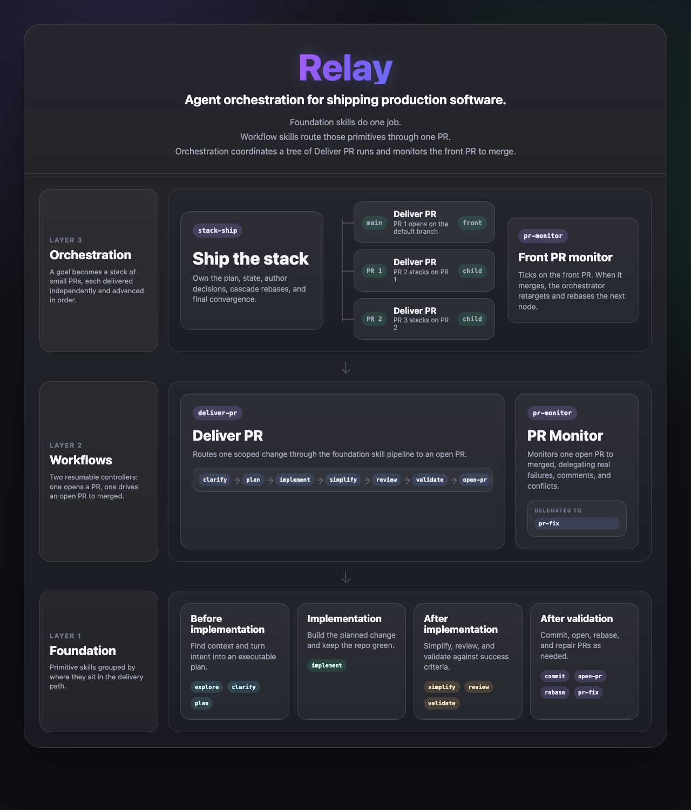

# Relay

Relay is an open-source system of **composable agent skills and workflows** that automate
software-engineering work through small, reusable building blocks. The root `skills/` tree is a
portable skills package for any supported agent, while Relay keeps richer templates in
`skills-template/` to generate optimized **Claude, Copilot, and Codex** packages.

The design principle is leverage through composition: small single-purpose skills compose into
workflows, workflows compose into an orchestrator, and heavy work is delegated to sub-agents so the
driving agent stays context-light. Every change is clarified, planned, implemented, simplified,
reviewed, validated, and monitored to merge.

## The three layers



| Layer | Skill | Role |
| --- | --- | --- |
| Foundation | `explore` | Build read-only codebase understanding. |
| Foundation | `clarify` | Turn fuzzy intent into requirements and acceptance criteria. |
| Foundation | `plan` | Produce an executable implementation blueprint. |
| Foundation | `implement` | Build the planned slice while keeping tests green. |
| Foundation | `simplify` | Reduce complexity without changing behavior. |
| Foundation | `review` | Run focused reviewer roles with confidence filtering. |
| Foundation | `validate` | Check acceptance criteria and repo quality gates. |
| Foundation | `commit` | Create one well-formed local commit. |
| Foundation | `rebase` | Rebase, resolve conflicts, and update the branch. |
| Foundation | `open-pr` | Commit, push, and open a pull request. |
| Foundation | `pr-fix` | Fix CI failures, review comments, and merge conflicts. |
| Foundation | `todo` | Capture and complete repo-scoped todos. |
| Foundation | `relay-status` | Inspect active and archived Relay projects. |
| Foundation | `relay-archive` | Archive a merged Relay project worktree. |
| Foundation | `build-write-like-me` | Build a reusable writing-voice skill from a corpus. |
| Workflow | `deliver-pr` | Drive one scoped change from clarification to an open PR. |
| Workflow | `pr-monitor` | Watch one PR to merge and delegate fixes as needed. |
| Orchestration | `stack-ship` | Decompose and ship a goal as a stack of small PRs. |

## The `relay` CLI

A thin Go binary that makes starting and resuming work ergonomic:

```bash
relay "Add retry logic to the HTTP client"     # create a worktree + project, launch the agent on deliver-pr
relay -n my-slug "..."                          # custom slug
relay --workflow stack-ship "<design goal>"     # launch the multi-PR orchestrator instead
relay                                           # list active projects
relay resume <slug>                             # reopen where you left off
```

It also owns the **`relay state`** machine — the deterministic, resumable state that workflow skills
read and update (so they never hand-edit JSON) — and the **`relay generate`** compiler that renders
the agent-neutral skill source into per-agent packages.

## Install

Requires Go 1.25+ and at least one supported coding-agent CLI on your `PATH`.

### Relay-managed workflows

```bash
git clone https://github.com/ronaknnathani/relay
cd relay
make install
relay setup codex      # or: relay setup claude / relay setup copilot
```

`make install` installs the `relay` binary. `relay setup <agent>` must be run from the relay
repository when you want the full Relay workflow system: generated per-agent skills, Relay-managed
symlinks, project state, worktrees, resumes, and workflow launch checks.

| Agent | Prerequisite | Setup command | Skill install location |
| --- | --- | --- | --- |
| Claude Code | `claude` on your `PATH` | `relay setup claude` | `~/.claude/skills` |
| Codex CLI | `codex` on your `PATH` | `relay setup codex` | `~/.codex/skills` |
| GitHub Copilot CLI | `copilot` on your `PATH` | `relay setup copilot` | `~/.copilot/skills` |

Rerun the same setup command whenever you want to refresh one agent's generated skills. To remove
Relay-managed links for an agent, run `relay setup <agent> --uninstall`. Skills relay does not own are
never clobbered: a real file/dir with a colliding name is skipped, and a symlink that does not point
into relay's own sources is flagged so you can choose whether to replace it.

### Standalone skills-only install

Use the repository directly when you only want the bare skills, without installing the `relay`
binary or creating Relay project state:

```bash
npx skills add ronaknnathani/relay
npx skills add ronaknnathani/relay --agent codex   # when your skills CLI advertises --agent
npx skills add ronaknnathani/relay --all           # when your skills CLI advertises --all

# local development
npx skills add .
```

This path installs standalone skill directories only. It does not replace `relay setup <agent>` for
Relay-managed workflows, because the CLI checks for Relay-managed skill links before launching a
workflow. Run `scripts/verify-npx-skills-add.sh` to probe the local `skills` CLI help and verify the
supported install flags in a disposable `HOME`.

### Relay CLI configuration

First run prompts for a branch prefix, your default agent, and that agent's permission mode (saved to
`~/.relay/config.json`). Permission modes are stored per agent and are requested only the first time
that agent is used.

```bash
relay config default-agent <agent>
relay config permission-mode <agent> <mode>
```

The branch prefix, default agent, and per-agent permission modes are stored in the same config file.
Project state lives under `~/.relay/projects/`; worktrees live under `<repo>/.worktrees/`.

## Multi-agent

Root `skills/` are bare, portable skills that the skills CLI can install with `npx skills add <repo>`.
Relay-specific templates live under `skills-template/`; they retain directives such as `{{subagent}}`
that carry model-tier intent for Relay's generator. `relay generate` renders the strongest mechanism
each agent supports — Claude's `Agent` tool and deterministic slash invocation, Copilot's prose
invocation and `AGENTS.md` context, and Codex's native skills under `~/.codex/skills` — rather than a
lowest-common-denominator. Generator tests compare the generated agent packages and root portable
skills to the Relay templates so the two trees do not drift.

## Contributing

See [CONTRIBUTING.md](CONTRIBUTING.md) for the skill anatomy, the agent-neutral authoring rules, and the
generate/test workflow.

## License

MIT — see [LICENSE](LICENSE). Some skills adapt content from open-source upstreams; see
[NOTICE](NOTICE) for attributions.
