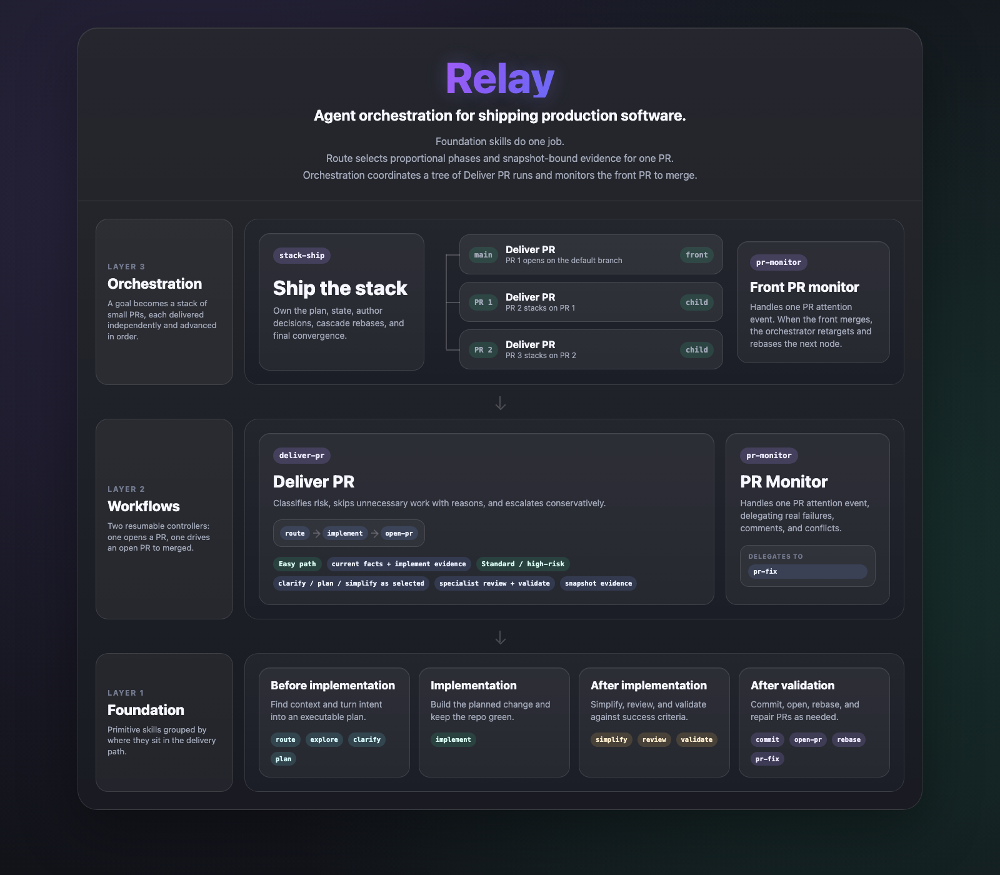

# Relay

Relay turns software work into durable, resumable workflows for coding agents. It works with Claude
Code, GitHub Copilot CLI, and Codex CLI.

Use Relay for:

- One change delivered as a pull request.
- A larger change delivered as an ordered stack of pull requests.
- A program where one tech lead agent manages goals, decisions, workers, and pull requests.

Relay keeps the state on disk. Agents can stop, restart, or hand work to a subagent without relying
on conversation history.

## Quick start

```bash
git clone https://github.com/ronaknnathani/relay
cd relay
make install
relay setup copilot
```

Replace `copilot` with `claude` or `codex` if needed.

Start a single change:

```bash
cd <your-repository>
relay "Add retry logic to the HTTP client"
```

Relay creates a branch, a worktree, and a project. It then launches `deliver-pr`, which drives the
change through:

```text
clarify -> plan -> implement -> simplify -> review -> validate -> open-pr
```

Resume it later with:

```bash
relay resume <project-slug>
```

## Workflows

### Deliver one pull request

`deliver-pr` is the default workflow. It delegates each phase to a focused subagent and records the
result under `~/.relay/projects/`.

```bash
relay "Add request validation to the API"
relay --name request-validation "Add request validation to the API"
```

When the project runs under Herdr, `deliver-pr` starts `relay pr watch` after the pull request opens.
It observes checks, review feedback, conflicts, and merge state, then wakes the exact project session
only when there is something to do. The watcher is read-only. `pr-monitor` triages the event and
delegates fixes to `pr-fix`. Outside Herdr, invoke `/pr-monitor` manually.

### Deliver a stack of pull requests

Use `stack-ship` when one goal needs several dependency-ordered pull requests.

```bash
relay --workflow stack-ship "Introduce the new storage API and migrate callers"
```

The orchestrator creates the stack, delegates each pull request through `deliver-pr`, watches the
front pull request, and advances the stack after merge. Agents never approve or merge their own work.

## Programs

Programs add a management layer above ordinary Relay projects. You describe a larger goal to one
tech lead agent. The tech lead turns it into contracts, decisions, and dependency-aware assignments.
Each assignment runs as its own visible worker session and produces a pull request.

You continue talking to the tech lead instead of managing each worker directly.

```text
You
 |
 v
Tech lead session
 |  goal, priorities, contracts, decisions
 v
Worker projects
 |  clarify, plan, implement, review, validate
 v
Pull requests
```

Managed programs require [Herdr](https://herdr.dev) and currently support Copilot and Claude. Herdr
keeps the tech lead, workers, program patrol, and PR watchers visible in separate terminal tabs.

Create a program from a Herdr pane:

```bash
cd <your-repository>
relay program new "Move our authentication system to short-lived tokens"
```

Relay creates a draft program and launches its tech lead. Work with the tech lead to define the goal,
approve architecture contracts, and resolve decisions. The tech lead then dispatches ready work to
worker sessions.

The program patrol checks durable state on its own schedule and rings the existing idle tech lead pane
when something needs attention, without changing the user's focus. Ask the tech lead for a change to a
pull request that already exists and it routes the request from live GitHub state; ask it to retire a
merged item and it stops that item's watcher, exits its worker, closes the tab, and archives the child
project.

Useful commands:

```bash
relay program status <program-slug>          # current program state
relay program queue <program-slug>           # ready, active, and blocked work
relay program resume <program-slug>          # reopen the tech lead session
relay program worker list <program-slug>     # live worker sessions
relay program worker cleanup <program-slug> <item>  # retire a merged item's runtime
relay program ui <program-slug>              # localhost read-only UI
relay program patrol status <program-slug>   # scheduler and wake status
relay program patrol start <program-slug>    # start the program patrol
```

Program state lives under `~/.relay/programs/`. Worker state remains under
`~/.relay/projects/`. Communication between the tech lead and workers uses durable inboxes and
outboxes. GitHub pull requests remain the review boundary, and a real human approval remains the
merge gate.

Read [Relay Programs](docs/programs.md) for the full model and command reference.

## Pull request watcher

The PR watcher moves deterministic polling out of the agent:

```bash
relay pr watch start <project-slug>
relay pr watch status <project-slug>
relay pr watch tick <project-slug>
relay pr watch stop <project-slug>
```

It checks immediately, then uses a 15, 30, and 60 minute backoff. New code, new actionable feedback,
or a changed blocker resets it to the fast interval. The watcher prints high-level activity in its
Herdr pane and stores private digests under `~/.relay/run/pr-watch/`.

Read [Relay PR Watch](docs/pr-watch.md) for cadence, routing, and digest details.

## Skills

Skills are authored once under `skills/` and generated for each supported agent.



The library has three layers:

1. **Foundation skills** handle one phase, such as `clarify`, `plan`, `implement`, `review`,
   `validate`, `pr-fix`, and `open-pr`.
2. **Workflow skills** compose phases. `deliver-pr` owns one pull request and `pr-monitor` handles one
   watcher event.
3. **Orchestrators** coordinate larger goals. `stack-ship` manages a PR stack and `tl` manages a
   Relay program.

Run `relay setup <agent>` after changing skills or updating Relay. Setup generates the agent package
and links Relay-managed skills into the agent's personal skill directory.

## Installation and configuration

Relay requires Go 1.25+ and at least one supported coding-agent CLI on `PATH`.

```bash
make install
relay setup <agent>
```

| Agent | Setup | Installed skills |
| --- | --- | --- |
| Claude Code | `relay setup claude` | `~/.claude/skills` |
| GitHub Copilot CLI | `relay setup copilot` | `~/.copilot/skills` |
| Codex CLI | `relay setup codex` | `~/.codex/skills` |

The first setup records a branch prefix, default agent, and permission mode in
`~/.relay/config.json`.

```bash
relay config default-agent <agent>
relay config permission-mode <agent> <mode>
```

Relay-managed state:

```text
~/.relay/config.json        user configuration
~/.relay/projects/          individual and worker projects
~/.relay/programs/          managed programs
~/.relay/run/               patrol and watcher runtime state
<repo>/.worktrees/          project worktrees
```

## Contributing

See [CONTRIBUTING.md](CONTRIBUTING.md) for skill conventions and the generation workflow.

## License

MIT. See [LICENSE](LICENSE) and [NOTICE](NOTICE).
